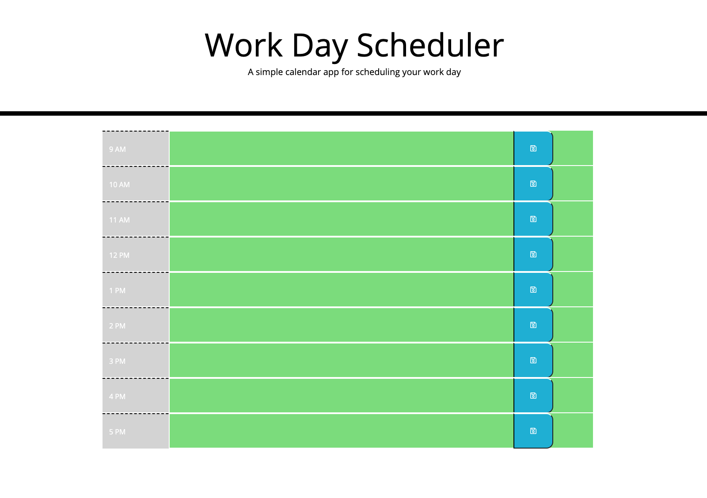

## Work Day Scheduler

## Description
For this project, I created a simple calendar application that allows users to save events for each hour of the day. I was given starter code, and asked to write JavaScript code that integrates Moment.js and the browser's local storage. 

While completing this project, I learned third party APIs, and local storage.

## Installation
[Here](https://alyscorpio.github.io/work_day_scheduler/) is a link to the deployed application.

[Here](https://github.com/alyscorpio/work_day_scheduler) is a link to the application's GitHub repository.

## Contributing
This application was created by Alys Dickerson under the direction of UCLA Coding Bootcamp.

## License
This application is covered under the MIT  license.

## Contact
For more information about my application, visit my [Github](https://github.com/alyscorpio).
For additional questions, please email me at alyssad1182@gmail.com.